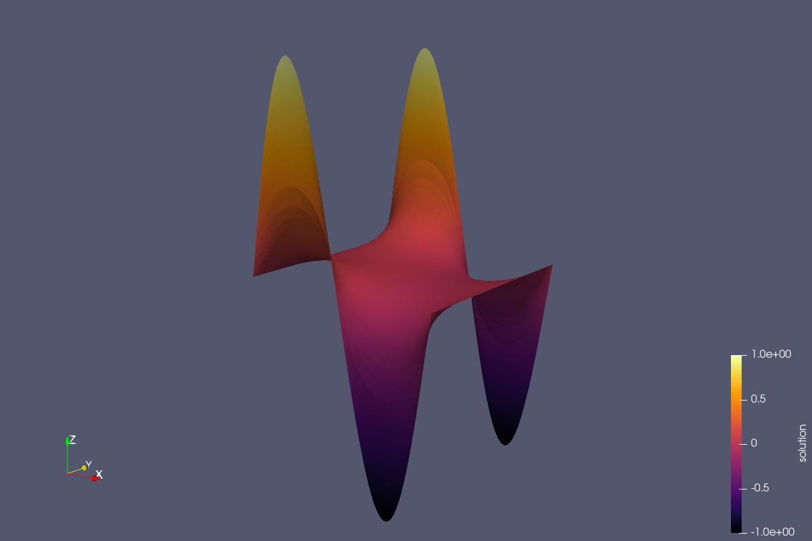

# MinSurFEM


MinSurFEM is a finite element solver for finding the minimal surface among all functions satisfying given boundary conditions. The project provides two implementations based on different finite element method libraries: [**deal.II**](https://www.dealii.org/) and [**FastFem**](https://github.com/edo01/FastFem) to enable direct comparison of their performance, accuracy, and ease of use. 

## Required software

This library depends on:
- `FastFem` available as a submodule in this repository
- `deal.II` version 9.3.1 or higher (optional)
- `OpenMP` (optional)

## Build

First clone the repository and its submodules:
```bash
git clone --recursive
```

Then build the project using CMake:
```bash
mkdir build
cd build
cmake ..
make
```

by default, if `deal.II` is found, the project will build two executables: `MinSurFastFEM` and `MinSurDealII`. If `deal.II` is not found, only `MinSurFastFEM` will be built. To execute them, run:

```bash
./src/dealII/MinSurDealII
./src/fastFEM/MinSurFastFEM
```

## Problem description
Given a bounded domain $\Omega \subset \mathbb{R}^2$ and a function $u: \Omega \to \mathbb{R}$, we can compute the area of the surface defined by the graph of $u$ over $\Omega$ as:
$A(u) = \int_{\Omega} \sqrt{1 + |\nabla u|^2} \, dx$. Here the area $A: H^1(\Omega) \to \mathbb{R}$ can be seen as a (convex) functional. Given a function g: $\partial \Omega \to \mathbb{R}$, we are interested in finding a function $u$ that minimizes $A(u)$ among all functions satisfying the boundary conditions $u = g$ on $\partial \Omega$. 
Since this is posed as a minimization problem, we can solve it using the Euler-Lagrange equation, which in this case boils down to solve the following PDE:

$div\left(\dfrac{\nabla u}{\sqrt{1 + |\nabla u|^2}}\right) = 0$ in $\Omega$

$u = g$ on $\partial \Omega$

Using the calculus of variations, this nonlinear second order PDE can be proven to be well-posed, given the convexity of the functional $A(u)$.

We follow a so called *differentiate-then-discretize* approach. First, we write the weak formulation of the problem. Let $V = H^1_0(\Omega)$ be the Sobolev space of functions in $H^1(\Omega)$ that vanish on the boundary. Then, the weak formulation of the problem is to find $u$ in the affine space $V + g$ such that:

$\int_{\Omega} \dfrac{\nabla u \cdot \nabla v}{\sqrt{1 + |\nabla u|^2}} \, dx = 0$ for all $v \in V$

We define the residual $R(u)(v) = \dfrac{\nabla u \cdot \nabla v}{\sqrt{1 + |\nabla u|^2}}$ which is nonlinear in $u$. Thus, we can employ the Newton method to solve the problem. In order to do so, we introduce the directional (*Fréchet*) derivative of the residual $R(u)(v)$ in the direction of a perturbation $\delta u$:

$D_u R(u)(\delta u, v) = a(u)(\delta u, v) = lim_{\epsilon \to 0} \dfrac{R(u + \epsilon \delta u)(v) - R(u)(v)}{\epsilon}$
$= \int_{\Omega} \dfrac{\nabla v \cdot \nabla \delta u}{\sqrt{1 + |\nabla u|^2}} - \dfrac{\nabla u \cdot \nabla \delta u}{(1 + |\nabla u|^2)^{3/2}} \nabla v \cdot \nabla u \, dx$

The Newton method consists in the following scheme:
1. We start with an initial guess $u^0$.
2. At the $k$-th iteration, we solve the linearized problem for the perturbation $\delta u^k$:

$a(u^k)(\delta u^k, v) = -R(u^k)(v)$ for all $v \in V$

which expands to

$\int_{\Omega} \dfrac{\nabla v \cdot \nabla \delta u^k}{\sqrt{1 + |\nabla u^k|^2}} - \dfrac{\nabla u^k \cdot \nabla \delta u^k}{(1 + |\nabla u^k|^2)^{3/2}} \nabla v \cdot \nabla u^k \, dx = -\int_{\Omega} \dfrac{\nabla u^k \cdot \nabla v}{\sqrt{1 + |\nabla u^k|^2}} \, dx$ for all $v \in V$

3. We update the solution $u^{k+1} = u^k + \alpha \delta u^k$ and repeat the process until convergence. In this step, we introduced a relaxation parameter $\alpha$ to get better global convergence behavior. 

It is important to note that the unkown of each iteration of the Newton method is not the solution $u$ itself, but rather the difference between two consecutive iterates $\delta u = u^{k+1} - u^k$. As a consequence of this, the value of $\delta u$ on the boundary is always zero (since $u^k = g$ on the boundary). This will allow us to work with homogeneous Dirichlet boundary conditions in the finite element discretization.

Now, we can discretize the problem using the finite element method. We introduce a triangulation $\mathcal{T}_h$ of the domain $\Omega$ and define $V_h \subset V$ as the finite element space stemming from scalar simplicial Lagrange elements (*P1*). At each iteration, we approximate the infinite dimensional linearized problem by a finite dimensional one, seeking $\delta u^k_h \in V_h$. 
If we denote by $\delta U^k$ the vector of the coefficients of $\delta u^k_h$ in the basis of $V_h$, we can write the problem as the following linear system:

$\mathbf{A^k} \delta U^k = \mathbf{b^k}$

where: 

$\mathbf{A^k_{ij}}=\int_{\Omega} c_n \nabla \phi_i \cdot \nabla \phi_j - c_n^3(\nabla u^k \cdot \nabla \phi_i)(\nabla u^k \cdot \nabla \phi_j) \, dx$ 

 $b^k_i = -\int_{\Omega} c_n \nabla \phi_i \cdot \nabla u^k \, dx$


Here $\phi_i$ are the basis functions of $V_h$ and $c_n = \dfrac{1}{\sqrt{1 + |\nabla u^k|^2}}$. Since the matrix can be proven to be symmetric and positive definite, we will use the conjugate gradient method to solve the linear system at each iteration.

## Results

We compare the performance of the two implementations by solving the minimal surface problem on a square domain with boundary conditions obtained from the function $g(x, y) = sin(2.0 * \pi * x)$ on the boundary. The domain is discretized using 12800 elements, for a total of 6561 degrees of freedom. 

**FASTFEM**
``` bash
Summary:
Setup time: 5.22e-03 seconds
Assemble time: 2.57e-03 seconds
Solve time: 5.22 seconds
Output time: 1.04e-02 seconds
Total time: 5.238 seconds
```

**DEALII**
``` bash
Summary:
Setup time: 3.25e-02 seconds
Assemble time: 1.38e-02 seconds
Solve time: 3.86 seconds
Output time: 3.18e-02 seconds
Total time: 3.942 seconds
```